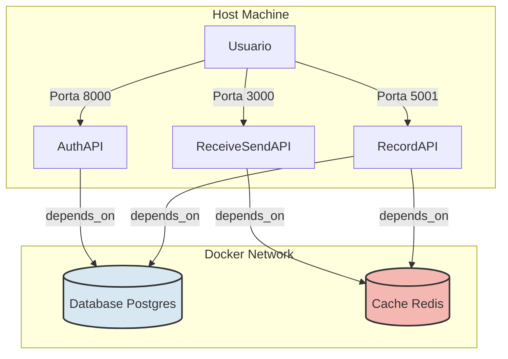

'''# Documentação do Pipeline de Build e Deploy

Este documento descreve o processo de build e deploy da aplicação utilizando Docker Compose e o script `deploy.sh`.

## Visão Geral da Arquitetura

A aplicação é composta pelos seguintes serviços containerizados:

*   `db`: Banco de dados PostgreSQL para persistência de dados.
*   `redis`: Cache Redis para gerenciamento de sessões ou dados temporários.
*   `auth-api`: API de autenticação (Laravel/PHP), exposta na porta 8000.
*   `receive-send-api`: API para recebimento e envio (Node.js), exposta na porta 3000.
*   `record-api`: API de gravação (Python/Flask), exposta na porta 5001.

O `docker-compose.yml` orquestra a inicialização e a comunicação entre esses serviços, definindo dependências e verificações de saúde (health checks).

## Pré-requisitos

*   Docker instalado e em execução.
*   Docker Compose instalado.
*   Permissões adequadas para executar comandos Docker (geralmente adicionando o usuário ao grupo `docker` ou usando `sudo`).
*   Código-fonte do projeto clonado ou baixado.

## Comandos de Build

O processo de build das imagens Docker é gerenciado automaticamente pelo script `deploy.sh` através do comando `docker-compose build`.

Para construir as imagens manualmente (por exemplo, para depuração), navegue até o diretório `/home/ubuntu/projeto_teste/teste/trabalho_final` (ou o diretório que contém o `docker-compose.yml` e os subdiretórios dos serviços) e execute:

```bash
docker-compose build
```

Este comando lerá os `Dockerfile` presentes nos diretórios `auth-api`, `receive-send-api` e `record-api` e construirá as respectivas imagens.

## Comandos de Deploy

O deploy da aplicação é automatizado pelo script `deploy.sh`.

1.  **Navegue até o diretório do projeto:**
    ```bash
    cd /path/to/your/project/trabalho_final
    ```
    (Substitua `/path/to/your/project` pelo caminho real onde o projeto foi descompactado/clonado).

2.  **Torne o script executável (apenas na primeira vez):**
    ```bash
    chmod +x deploy.sh
    ```

3.  **Execute o script de deploy:**
    ```bash
    ./deploy.sh
    ```

**O que o script `deploy.sh` faz:**

*   Verifica se o arquivo `docker-compose.yml` existe.
*   Para e remove containers de execuções anteriores (`docker-compose down --remove-orphans`).
*   Constrói as imagens Docker, se necessário (`docker-compose build`).
*   Inicia todos os serviços em modo detached (`docker-compose up -d`).
*   Monitora os health checks definidos no `docker-compose.yml` para os serviços `db`, `redis`, `auth-api` e `record-api`.
*   Aguarda até que os serviços estejam saudáveis (ou atinge um timeout de 120 segundos).
*   Registra toda a saída em um arquivo de log (`deploy_YYYYMMDD_HHMMSS.log`).
*   Indica sucesso ou falha no final da execução.

## Diagrama dos Containers e Fluxos de Rede (Simplificado)



**Fluxo:**

1.  O usuário interage com as APIs através das portas expostas no host (`8000`, `3000`, `5001`).
2.  Internamente, na rede Docker criada pelo Compose:
    *   `auth-api` e `record-api` se conectam ao banco de dados `db`.
    *   `receive-send-api` e `record-api` se conectam ao cache `redis`.
3.  As dependências (`depends_on` com `condition: service_healthy`) garantem que os serviços só iniciem completamente após suas dependências estarem saudáveis.

## Casos de Teste (Verificação Pós-Deploy)

Após a execução bem-sucedida do `deploy.sh`, verifique se a aplicação está funcionando corretamente:

1.  **Verificar Status dos Containers:**
    ```bash
    docker-compose ps
    ```
    Todos os serviços devem estar com o status `Up` e, para aqueles com health check, o status de saúde deve ser `(healthy)`.

2.  **Testar Health Checks (se aplicável):**
    *   **Auth API:** Acesse `http://localhost:8000/` (ou o endpoint de health check específico, se houver) via navegador ou `curl`. O `docker-compose.yml` usa `curl -f http://localhost/` dentro do container.
    *   **Record API:** Acesse `http://localhost:5001/` (ou o endpoint de health check específico) via navegador ou `curl`. O `docker-compose.yml` usa `curl -f http://localhost:5001` dentro do container.
    *   **Receive/Send API:** Embora não tenha um health check explícito no compose, tente acessar `http://localhost:3000/` para verificar se o servidor Node.js está respondendo.

3.  **Testar Endpoints Principais das APIs:**
    *   Realize requisições básicas para os endpoints funcionais de cada API (`auth-api`, `receive-send-api`, `record-api`) para garantir que estão operacionais e se comunicando corretamente com `db` e `redis`.

## Pontos de Falha Comuns e Soluções

*   **Erro: `docker-compose: command not found` ou `docker: command not found`**
    *   **Causa:** Docker ou Docker Compose não estão instalados ou não estão no PATH do sistema.
    *   **Solução:** Instale o Docker e o Docker Compose seguindo a documentação oficial para o seu sistema operacional.

*   **Erro: `Cannot connect to the Docker daemon... Is the docker daemon running?`**
    *   **Causa:** O serviço do Docker não está em execução ou o usuário não tem permissão para acessá-lo.
    *   **Solução:** Inicie o serviço do Docker (`sudo systemctl start docker` ou equivalente) e/ou adicione seu usuário ao grupo `docker` (`sudo usermod -aG docker $USER`, requer logout/login).

*   **Erro durante o `docker-compose build`:**
    *   **Causa:** Problemas no `Dockerfile` (comandos inválidos, falha ao baixar dependências, arquivos não encontrados).
    *   **Solução:** Verifique a saída do build no console ou no log do `deploy.sh`. Analise o `Dockerfile` do serviço que falhou e corrija os erros. Tente construir a imagem manualmente (`docker-compose build <service_name>`) para isolar o problema.

*   **Erro: `Bind for 0.0.0.0:XXXX failed: port is already allocated`**
    *   **Causa:** Outro processo na máquina host já está usando uma das portas que um container tenta expor (8000, 3000 ou 5001).
    *   **Solução:** Identifique e pare o processo que está usando a porta (`sudo lsof -i :XXXX` ou `netstat -tulnp | grep XXXX`) ou altere a porta no `docker-compose.yml` (ex: `ports: - "8001:80"`).

*   **Serviço fica em estado `unhealthy` ou não inicia:**
    *   **Causa:** Erros internos na aplicação do container, falha ao conectar com dependências (db, redis), configuração incorreta.
    *   **Solução:** Verifique os logs do container específico:
        ```bash
        docker-compose logs <service_name>
        # Para ver logs em tempo real:
        docker-compose logs -f <service_name>
        ```
        Analise os logs para identificar a causa raiz do problema (ex: erro de conexão com banco de dados, variável de ambiente faltando, erro de código).

*   **Script `deploy.sh` falha com timeout esperando health checks:**
    *   **Causa:** Um ou mais serviços (`db`, `redis`, `auth-api`, `record-api`) não atingiram o estado `healthy` dentro do tempo limite (120s).
    *   **Solução:** Verifique os logs dos serviços que não ficaram saudáveis (`docker-compose logs <service_name>`) para entender por que o health check está falhando. Pode ser um problema de inicialização lenta, erro de configuração ou falha na aplicação.

*   **Problemas de Permissão de Volume (especialmente para `db_data`):**
    *   **Causa:** O Docker pode ter problemas para escrever no volume montado devido a permissões do sistema de arquivos host.
    *   **Solução:** Verifique as permissões do diretório no host onde o Docker gerencia os volumes. Em alguns casos, pode ser necessário ajustar permissões ou usar volumes nomeados gerenciados pelo Docker.

**Sempre verifique o arquivo de log gerado pelo `deploy.sh` (`deploy_*.log`) para obter detalhes sobre qualquer erro ocorrido durante o processo.**
'''
